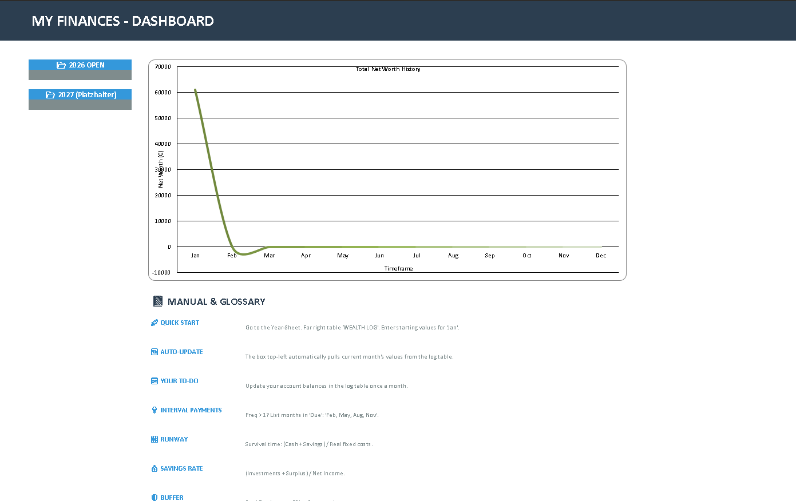
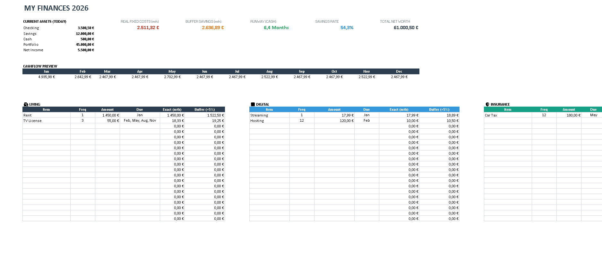

# pycli-excel-finance-sheet-generator

> A Python CLI tool to generate automated financial planning spreadsheets in Excel.

  

## Screenshots

### Dashboard View



### Single Sheet View


## Table of Contents

* [Features](#features)
* [Installation](#installation)
* [Usage](#usage)
* [How to Use the Excel Sheet](#how-to-use-the-generated-excel-sheet)
    * [1. Managing Expenses & Frequency](#1-managing-expenses--frequency-the-tables)
    * [2. Updating Account Balances](#2-updating-account-balances-wealth-log)
    * [3. Understanding the KPIs](#3-understanding-the-kpis)
* [License](#license)

## Features

* **Multi-Language Support:** Choose between **English** and **German** for all text, headers, and explanations.
* **Two Modes:**
    * **Single Sheet:** A focused planner for the selected year.
    * **Dashboard Mode:** Includes a Management Dashboard, Navigation Buttons, and visualized Chart Data.
* **Smart Logic:**
    * **Auto-Updating Assets:** The "Current Assets" box (top-left) automatically displays the values for the *current month* based on your entries in the transaction log.
    * **Cashflow Preview:** A monthly calendar view that calculates exactly how much money will leave your account each specific month, accounting for irregular payments (e.g., quarterly taxes).
    * **Real Fixed Costs:** Automatically calculates monthly averages for annual/quarterly payments to determine your true monthly burn rate.
    * **Safety Buffer:** Calculates a recommended 5% buffer on top of your real costs.
    * **Runway Calculation:** Tells you exactly how many months you can survive without income.
* **Pro Design:** Grid-less layout with professional color coding (Navy/Blue theme).
* **CLI Interface:** Interactive console menu with error handling.

## Installation

1.  **Clone the repository:**
    ```bash
    git clone https://github.com/lpj-app/pycli-excel-finance-sheet-generator.git

    cd pycli-excel-finance-sheet-generator
    ```

2. **Create virtual environment*:* 
    Create a virtual environment for required packages
    ```bash
    python -m venv ./venv
    ```
    to activate this environment
    ```bash
    .\venv\Scripts\activate
    ```

3. **Install requirements:**
    ```bash
    pip install -r requirements.txt
    ```

## Usage

Run the main script from your terminal:

```bash
python main.py
```

Follow the interactive prompts:

1. **Select Language:** `DE` or `EN`.
2. **Enter Year:** e.g., `2026` (Defaults to current year).
3. **Select Mode:**
* `1` for Single Sheet.
* `2` for Full Dashboard (Recommended).


---

## How to Use the Generated Excel Sheet

Once you open your generated file, here is how to manage your data to ensure the automation works correctly.

### 1. Managing Expenses & Frequency (The Tables)

In the expense blocks (Living, Digital, Insurance, etc.), enter your costs. The **Cashflow Preview** relies heavily on how you fill out the **Frequency** and **Due** columns:

* **Monthly Payments:**
* **Freq (Turnus):** Enter `1`.
* **Due (Fällig):** You can leave this blank or write "Monthly".
* *Result:* The amount is deducted automatically in every month of the Cashflow Preview.


* **Irregular Payments (Quarterly, Annually, etc.):**
* **Freq (Turnus):** Enter the interval (e.g., `3` for quarterly, `12` for annually).
* **Due (Fällig):** **Crucial!** You must list the specific 3-letter month abbreviations where the payment occurs.
* *Example:* For a quarterly payment starting in February, enter: `Feb, May, Aug, Nov`.
* *Result:* The Cashflow Preview will only deduct this amount in those specific months, giving you a precise liquidity forecast.


### 2. Updating Account Balances (Wealth Log)

To keep your Dashboard charts and the "Current Assets" box up to date:

1. Scroll to the far right of the sheet to the **Wealth Log (Vermögens-Verlauf)** table.
2. **Once a month** (e.g., on the last day), enter your actual account balances (Checking, Savings, Depot, etc.) into the row for that month.
3. **Automatic Update:**
* The **Dashboard Charts** will instantly reflect the new data points.
* The **Current Assets (Top Left)** box uses a smart formula (`=INDEX...MATCH...TODAY`) to always show you the balances of the *current month*. You never need to edit the top-left box manually!


### 3. Understanding the KPIs

* **Real Fixed Costs:** This takes all your payments (even the yearly ones divided by 12) to show your true monthly cost of living.
* **Buffer:** This is your Real Fixed Costs + 5%. If you keep this amount in your checking account, you are safe from fluctuations.
* **Runway:** Calculates `(Cash + Savings) / Monthly Fixed Costs`. It shows how long you can survive if your income hits zero today.

---
## License

See [LICENSE](./LICENSE).

--- 

&copy; [lpj.app](https://github.com/lpj-app). Licensed under MIT.